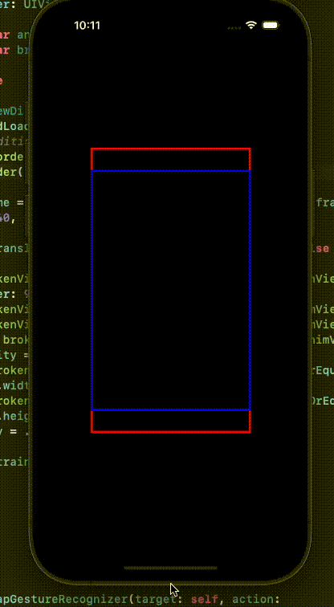

# SpringAnimsWithConstraintsAreBroken
Spring Animations With Constraints are Broken

This is a simple app to demonstrate an issue with constraint-based layouts + spring animations.  

A subview (bordered in red) is constrained inside it's superview (bordered in blue) to have a fixed aspect ratio, centered on x+y, and initially an equal width.  Additionally, and at a higher priority than the 'width' constraint, the view should also always be taller and wider.

The superview is then animated from an aspect ratio != subview fixed aspect ratio -> subview aspect ratio.  The spring animation is exaggerated to highlight the effect.  

You would expect to see the red view maintain it's aspect ratio, but always be taller and wider than the blue view.  It does not.  Addtionally, there are no warnings, errors, or anything of that nature indicating that UIKit is ignoring some constraints that usually come along with UIKit ignoring constraints.




Constraints:
```swift
        let ac = brokenView.widthAnchor.constraint(equalTo: brokenView.heightAnchor, multiplier: 9/16)
        let xc = brokenView.centerXAnchor.constraint(equalTo: animView.centerXAnchor)
        let yc = brokenView.centerYAnchor.constraint(equalTo: animView.centerYAnchor)
        let widthC = brokenView.widthAnchor.constraint(equalTo: animView.widthAnchor)
        widthC.priority = .defaultLow
        let gewc = brokenView.widthAnchor.constraint(greaterThanOrEqualTo: animView.widthAnchor)
        let geHC = brokenView.heightAnchor.constraint(greaterThanOrEqualTo: animView.heightAnchor)
```
